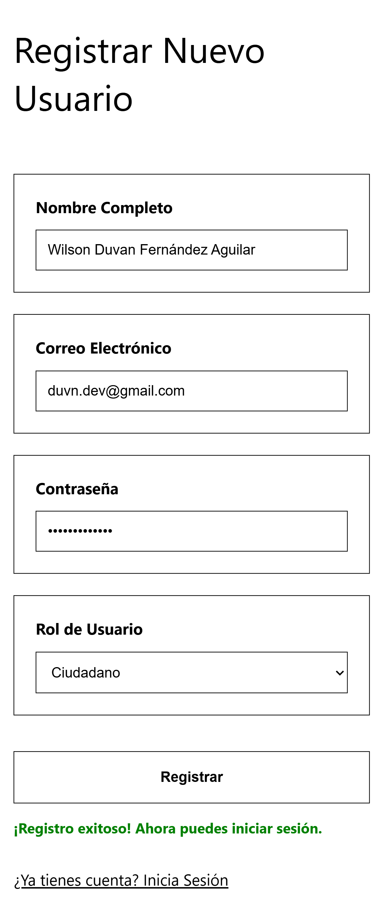
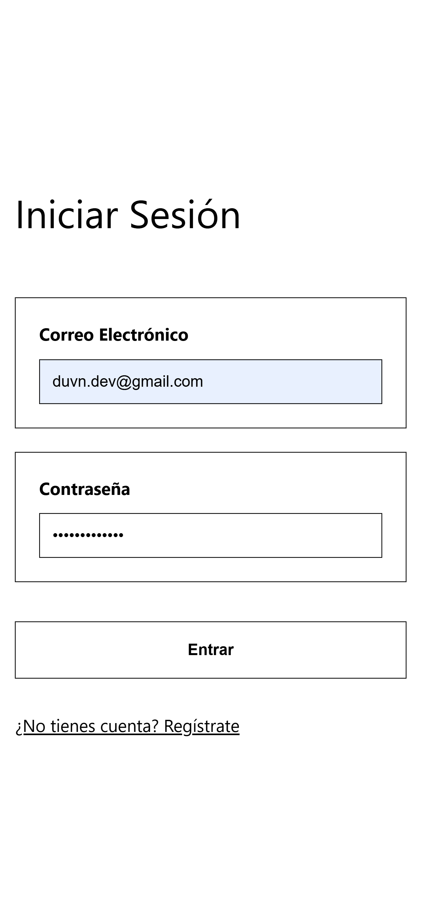
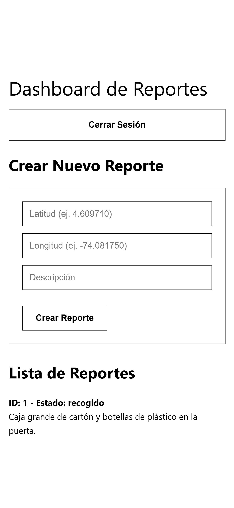

# API Backend - Plataforma de Gestión de Residuos

Este repositorio contiene el código fuente del **servicio de backend** para el proyecto "Plataforma tecnológica para optimizar la gestión de residuos sólidos en Bogotá".

Esta API RESTful es la responsable de gestionar toda la lógica de negocio, la interacción con la base de datos y la seguridad de la aplicación. Está diseñada para ser consumida por uno o varios clientes, como una aplicación web (frontend) o una aplicación móvil.

> **Nota:** El código fuente del frontend final en React se encuentra en un repositorio separado para mantener un desarrollo desacoplado y organizado.
>
> **Repositorio del Frontend:** `[ENLACE AL REPOSITORIO DEL FRONTEND CUANDO EXISTA]`

## Características del Backend

*   **Autenticación Segura:** Sistema de registro y login basado en JSON Web Tokens (JWT) con encriptación de contraseñas (bcrypt).
*   **Gestión de Roles:** Diferenciación entre usuarios 'ciudadano' y 'reciclador' para control de acceso a funcionalidades específicas.
*   **CRUD de Reportes:** Endpoints completos para crear, leer, actualizar y eliminar reportes de residuos.
*   **Cliente de Prueba Incluido:** Incluye un frontend simple en HTML y JavaScript para demostración y validación rápida de la API.
*   **API RESTful:** Sigue los principios de diseño REST para una comunicación predecible y estandarizada.

## Tecnologías Utilizadas

*   **Runtime:** Node.js
*   **Framework:** Express.js
*   **Base de Datos:** PostgreSQL
*   **Autenticación:** JSON Web Tokens (`jsonwebtoken`), `bcrypt.js`
*   **Driver de DB:** node-postgres (`pg`)

## Instalación y Puesta en Marcha

Sigue estos pasos para levantar el entorno de desarrollo local del backend.

### Prerrequisitos

*   Node.js (versión LTS recomendada)
*   PostgreSQL
*   Git

### Pasos

1.  **Clonar el repositorio:**
    ```bash
    git clone https://github.com/TuUsuario/gestion-residuos-api.git
    cd gestion-residuos-api
    ```
    *(Reemplaza `TuUsuario` con tu nombre de usuario de GitHub)*

2.  **Instalar dependencias:**
    ```bash
    npm install
    ```

3.  **Configurar la base de datos:**
    *   Crea una base de datos en PostgreSQL llamada `residuos_db`.
    *   Ejecuta el script `database.sql` que se encuentra en la raíz del proyecto para crear las tablas necesarias.

4.  **Configurar variables de entorno:**
    *   Crea un archivo `.env` en la raíz del proyecto y añade las siguientes variables, reemplazando los valores con tus credenciales:
    ```
    PORT=3000
    DB_USER=postgres
    DB_HOST=localhost
    DB_DATABASE=residuos_db
    DB_PASSWORD=tu_contraseña_secreta
    DB_PORT=5432
    JWT_SECRET=un_secreto_muy_largo_y_dificil_de_adivinar
    ```

5.  **Iniciar el servidor de desarrollo:**
    ```bash
    npm run dev
    ```
    La API estará escuchando peticiones en `http://localhost:3000`.

## Cliente de Prueba HTML

Este repositorio incluye un cliente web simple ubicado en la carpeta `/public` para facilitar las pruebas y la demostración visual de la API sin necesidad de configurar el frontend completo.

Una vez que el servidor esté corriendo (`npm run dev`), puedes acceder a las siguientes páginas desde tu navegador:

*   **Registro:** `http://localhost:3000/registro.html`
*   **Login:** `http://localhost:3000/login.html`
*   **Dashboard (requiere login):** `http://localhost:3000/dashboard.html`

### Capturas de Pantalla

| Registro de Usuario | Inicio de Sesión | Dashboard de Reportes |
| :---: | :---: | :---: |
|  |  |  |

## Documentación de Endpoints

A continuación se detallan los endpoints disponibles en esta API, que pueden ser probados con herramientas como Postman o a través del cliente de prueba.

### Autenticación (`/api/auth`)

*   `POST /register`: Registra un nuevo usuario.
*   `POST /login`: Inicia sesión y devuelve un token JWT.

### Reportes (`/api/reportes`)

*   `GET /`: Obtiene todos los reportes (Pública).
*   `GET /:id`: Obtiene un reporte por su ID (Pública).
*   `POST /`: Crea un nuevo reporte (Protegida, requiere token).
*   `PUT /:id`: Actualiza un reporte (Protegida, requiere token de 'reciclador').
*   `DELETE /:id`: Elimina un reporte (Protegida, requiere token del dueño o 'admin').